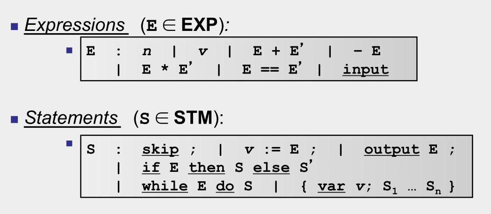
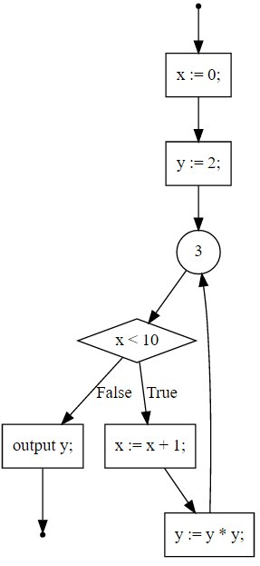

$$
\newcommand{constr}[2]{\llbracket #1 \rrbracket = #2}
$$
# Automatic Software Analysis - A General Framework
By Oscar Toro and Adam Schønemann

## Introduction
This report will elaborate on the design and implementation of a general framework
for defining automatic software analyses on a small toy-programming language (C--).
The framework is implemented in Haskell.

## Overview
Software analysis is the process of taking a program as input, analysing that program
and give an approximation of a property of that program. This approximation can in
turn be used to optimize the program, guide the programmer, or warn the programmer
about potential errors.

## Modeling the Language
In order to to analyze a program, one needs a concrete representation of that program
as data. The program we'll be analysing in this report, is the simple program called
C--.
The syntax for C-- is defined by the following grammar:


In Haskell, we can use Algebraic Datatypes to model this grammar:
```Haskell
-- Expression grammar
data Expr
  = Add Expr Expr
  | Sub Expr Expr
  | Mul Expr Expr
  | Gt  Expr Expr
  | Lt  Expr Expr
  | Eq  Expr Expr
  | BLit Bool
  | ILit Int
  | Var String
  | Input
  
-- Grammar for "simple" statements
data Stmt
  = Skip
  | Ass String Expr
  | Output Expr
  
-- Grammar for compound statements (or sub-programs)
data SubProg
  = ITE Expr SubProg SubProg
  | Block [SubProg]
  | While Expr SubProg
  | Single Stmt

type Program = [SubProg]
```
Note some discrepancies between the grammar and the Haskell data-types:

- The expression grammar contains some extra operators as well as the Boolean
  literals
- The grammar for statements has been split in two:
    - Simple statements (`Output`, `Assign` and `Skip`)
    - Compund statements (`ITE`, `While`, `Block`)
        - These are statements that contain other statements, or "sub-programs"
- The variable declaration syntax (`var v;`) has been omitted, for simplicity

The reason for splitting the Statement grammar in two, is to have better type-safety
guarantees when implementing some algorithms later. Semantically, it is also
beneficial to distinguish between simple and compound statements.

#### Parsing
In order to work with programs in C--, the programmer will write programs in textual
form, and a parser will take care of converting this form to the Haskell
representation shown above. An excerpt of the parser is shown below.

```Haskell
program :: Parser Program
program = spaces *> many (stmt <* spaces)

stmt :: Parser SubProg
stmt =  (const $ Single Skip) <$> trystring "skip" <* spaces <* char ';' <* spaces
    <|> ITE <$> (trystring "if" *> spaces1 *> expr) <*>
                     (trystring "then" *> spaces1 *> stmt <* spaces) <*>
                     (trystring "else" *> spaces1 *> stmt <* spaces)
    <|> While <$> (trystring "while" *> spaces1 *> expr) <*>
                     (trystring "do" *> spaces1 *> stmt) <* spaces
    <|> (Single . Output) <$> (trystring "output" *> spaces1 *> expr <* char ';') <* spaces
    <|> (\v e -> Single $ Ass v e) <$> (ident <* spaces) <*> (string ":=" *> spaces *> expr <* char ';') <* spaces
    <|> Block <$> (brackets block) <* spaces
      where
        block = sepBy stmt spaces
```

The parser is implemented using the `Parsec` library. Since we do not use a lexer,
we have to be careful with the spaces - but otherwise, the parser very closely
resembles the grammar. Below is an example program in C-- and its corresponding
AST.

```
x := 0;
y := 2;
while x < 10 do {
  x := x + 1;
  y := y * y;
}
output y;

-- AST
[ Single (Ass "x" (ILit 0))
, Single (Ass "y" (ILit 2))
, While (Lt (Var "x") (ILit 10))
     (Block [ Single (Ass "x" (Add (Var "x") (ILit 1)))
            , Single (Ass "y" (Mul (Var "y") (Var "y")))
            ])
, Single (Output (Var "y"))
]
```

## Control-Flow Graph
Once we have a concrete model of a program, we can perform analyses on this model.
To do so, we can create a control-flow graph (CFG) of the program, that represents the
order in which the statements in program is executed. Below is the control-flow
graph corresponding to the program above.



In Haskell, the control-flow graph is modeled as a `Map` from `ID` (an `Int`) to
a `Node`.

```Haskell
type ID = Int
type In = ID
type Out = ID
type BrTrue = ID
type BrFalse = ID
type End = ID

data Node
  = NSource Out
  | NSingle Stmt In Out
  | NITE Expr In BrTrue BrFalse End -- end of the conditional (points to confluence)
  | NWhile Expr In BrTrue BrFalse End -- end of the conditional (points to confluence)
  | NConfl (In, In) Out
  | NSink In
```
As can be seen in the code, a `Node` in the graph is either a `Source` (the start
of the program), a `NSingle` (a node containing a single statement), an `NITE`
representing an if-then-else statement, a `NWhile` (a while statemnet), a `NConfl`,
which is a confluence node, or, finally, a `NSink` which is the end of the program.

Notice that the nodes themselves contain their in- and out-going edges.
This representation, rather than a more general graph-representation, with a set
of nodes and edges, allows for better performance and more type-safety, as the
types guarantee the number of edges going in-and-out of the nodes, which statically
prevents the construction of most non-wellformed graphs.

Along with graph-representations are functions that can transform the AST of a 
C-- program to its corresponding CFG (`Program -> CFG`)
and the inverse function (`CFG -> Program`)

## The Analysis
Given the CFG of a program you can perform a number of different analyses on that
program. In order to define analyses in a declarative and concise manner, we've
attempted to create an analysis framework that is independent of the specific
analyses. To do this, we have defined some typeclasses and datatypes that allows
users of the framework to define their own analyses declaratively.

### The Lattice
Central to any analysis the type of lattice that is used. Formally, a lattice
is a **partial order** with an operation $⊔S$ (called *join* or *least upper bound*) that exists for all subsets 
$S ⊆ L$. For finite lattices (which we are interested in, only), $⊔$ need
only be defined for each **pair** of elements in $S$.

A partial order is defined as a structure $(S, ⊑)$ where $S$ is a set and $⊑$ is a 
binary relation on $S$ that satisfies:

- Reflexivity: $∀x ∈ S.\; x ⊑ x$
- Transitivity: $∀x,y,z ∈ S.\;  x ⊑ y ∧ y ⊑ z ⇒ x ⊑ z$
- Anti-Symmetry: $∀x,y ∈ S.\; x ⊑ y ∧ y ⊑ x ⇒ x = y$

To generalise this notion, we have defined a lattice typeclass called `Lat`.

```Haskell
class (Ord a, Eq a, Show a) => Lat a where
  bottom          :: Program -> a
  leastUpperBound :: a -> a -> a
  top             :: Program -> a

-- the simplest lattice possible (one-element lattice)
data UnitLat = UnitLat deriving (Ord, Eq, Show)

instance Lat UnitLat where
  bottom              = const UnitLat
  leastUpperBound _ _ = UnitLat
  top                 = const UnitLat
```
To make a datatype an instance of the `Lat` typeclass, the programmer will have
to define the `top`, `bottom` and `leastUpperBound` functions. The `top` and `bottom`
functions take a program as input, in order to dynamically generate the top
and bottom elements specific to that program. The constraints `Ord a` and `Eq a`
on the typeclass definition makes sure that a partial order is defined for the type
parameter `a` before you can instance it as a lattice.

### The Analysis Type
An analysis is represented as a concrete record, whose arguments are functions
that represent the transfer functions associated with the specific analysis.

```Haskell
data Analysis a
  = Analysis { singleToTFun :: Stmt -> TFun a
             , condToTFun :: Expr -> TFun a
             , getDeps    :: Node -> Map ID a -> a
             }
```
To construct a new analysis, you must provide a function that creates a 
transfer function from a single statement, and a transfer function from a 
conditional, as well as a function that specifies how to resolve the dependencies
of the program-points.


### Program-Points
After constructing the CFG of a program, one would generate program-points
from this CFG. The program-points represent the result of the analysis at a 
specific point of the execution of the program. A program-point has an associated
transfer-function that, given an "environment lattice" that represents the
result of the analysis at a previous program-point, updates the result to reflect
the effect of the statement at the current program-point.

In our implementation, we have chosen not to model program-points as an explicit
datatype, but implicitly in terms of the recursive equations derived from the
control-flow graph.

### Recursive Equations
From each program point and its associated transfer function, an equation that
encodes how the analyses progresses from each program-point (or statement) to 
the next should be generated.

```Haskell
-- a function from dependencies to a single lattice element
type Equation a = Map ID a -> a
```
An equation over the type parameter `a` is simply modeled as a function from
a `Map ID a` to `a`. That is, the equation receives a map from program-point
IDs to their corresponding lattice elements, and produces a new lattice element
according to its dependencies. For example, in the CFG above, the equation
corresponding to the statement `y := 2;` would take a `Map` containing the results
of the previous iteration of the fixedpoint algorithm, select the lattice element
corersponding to `x := 0;` and apply its associated transfer function to that
lattice element. In case of e.g. the "Available Expressions" analysis, given that
the ID of `x := 0;` is $1$ the equation
for `y := 2;` would be `\env -> assign "y" (ILit 2) (lookup 1 env)`.

Consequently, given that the example program we've used so far yields the following
recursive equations:
$$
\begin{array}{lll}
entry   &=& \emptyset \\
x := 0; &=& entry ∪ assign_x(0) \\
y := 2; &=& x := 0; ∪ assign_y(2) \\
x < 10  &=& (y := 2; ∩ y := y * y;) ∪ exprs(x < 10) \\
x := x + 1; &=& x < 10 ∪ assign_x(x + 1) \\
y := y * y; &=& x := x + 1; ∪ assign_y(y * y) \\
\mathtt{output\ }y;   &=& x < 10 ∪ exprs(y)
\end{array}
$$

the Haskell representation can be conceptualized as follows:
```Haskell
case nodeId of
    0 -> \env -> S.empty                                                -- entry
    1 -> \env -> (get 0 env) `union` assign "x" (ILit 0)                -- x := 0;
    2 -> \env -> (get 1 env) `union` assign "y" (ILit 2)                -- y := 2;
    3 -> \env -> leastUpperBound (get 2 env) (get 6 env)                -- confluence
    4 -> \env -> (get 3 env) `union` exprs (Var "x" `Lt` (ILit 10))     -- x < 10
    5 -> \env -> (get 4 env) `union` assign "x" (Var "x" `Add` Lit 1)   -- x := x + 1
    6 -> \env -> (get 5 env) `union` assign "y" (Var "y" `Mul` Var "y") -- y := y * y
    7 -> \env -> (get 4 env) `union` exprs (Var "y")                    -- output y
    8 -> \env -> env                                                    -- sink
```

### Solving the equations using the fixed-point theorem
Now that the equations have been modeled, we can easily build the "big transfer function"

```Haskell
type BigT a = Map ID a -> Map ID a

eqsToBigT :: Lat a => Map ID (Equation a) -> BigT a
eqsToBigT eqs l = M.map ($ l) eqs
```

and now, we can use this structure to solve the recursive equations using the
fixed-point theorem, translated to Haskell using the `fix` combinator.

```Haskell
-- fixpoint operator!
fix :: (a -> a) -> a
fix f =
  let x = f x
  in  x

-- solveFix without explicit recursion
solveFix :: Lat a => Map ID a -> BigT a -> Map ID a
solveFix = fix (\f l bigT ->
                   let l' = bigT l
                   in if (l == l') then l else f l' bigT
                )
```

Here, Haskell's lazy evaluation allows us to translate the mathematical definition
of the fixpoint combinator almost verbatim.

This concludes the section of the report concerning the structure of the analysis
framework.